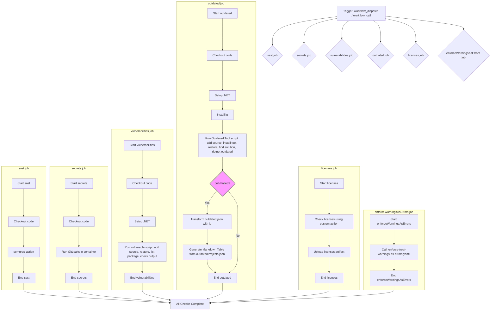
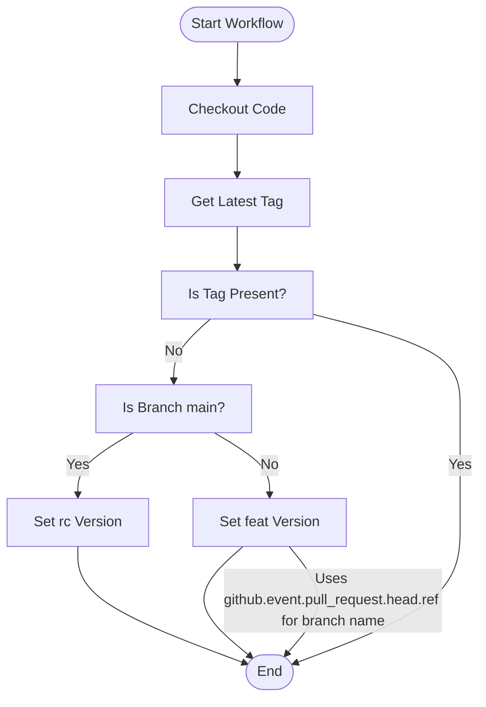
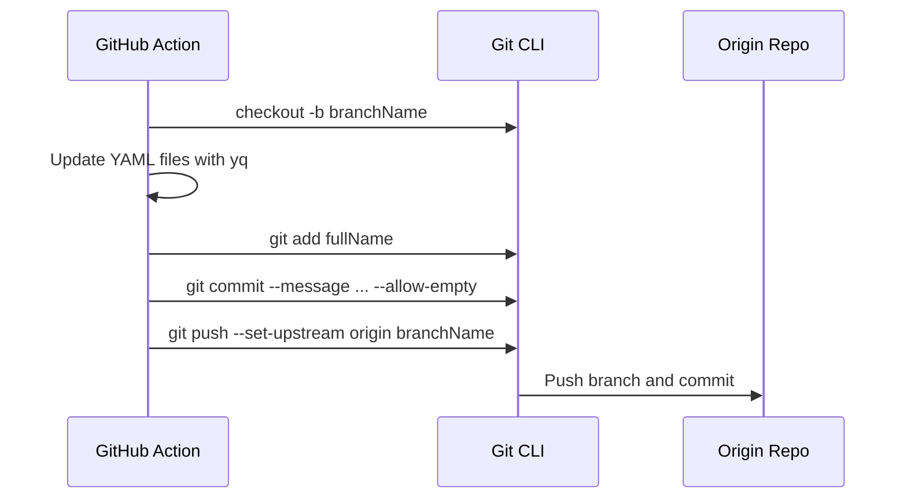
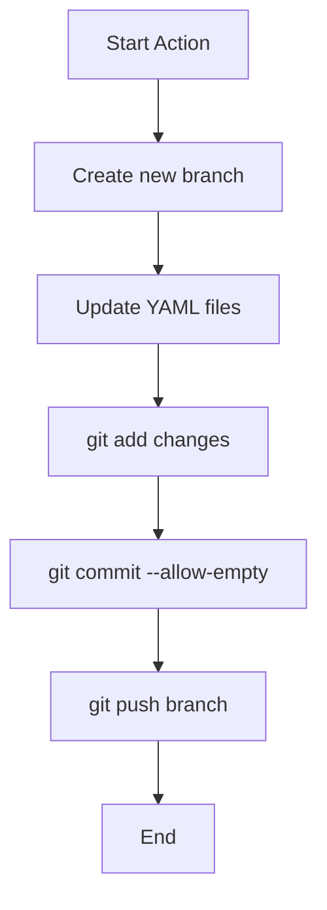

# Oui-DELIVER

**Reusable CI/CD workflows and GitHub Actions for modern software delivery**

[](https://opensource.org/licenses/MIT)
[](https://github.com/features/actions)
[](https://www.anthropic.com/claude)

Oui-DELIVER provides production-ready, reusable GitHub Actions workflows for .NET, Node.js, Python, Angular, and Next.js projects. Deploy with confidence using our comprehensive CI/CD pipeline that includes security scanning, automated testing, container builds, AI-powered code quality review, and deployment risk assessment.

## 🚀 Quick Start

### For .NET Projects

```yaml
name: Build and Deploy
on: [push, pull_request]

jobs:
  build:
    uses: innago-property-management/Oui-DELIVER/.github/workflows/build-publish.yml@main
    with:
      imageName: my-service
      argoCdRepoName: innago-property-management/argocd-apps
      minimumCoverage: 80
    secrets:
      githubToken: ${{ secrets.GITHUB_TOKEN }}
      cosignKey: ${{ secrets.COSIGN_KEY }}
      cosignPassword: ${{ secrets.COSIGN_PASSWORD }}
```

### For Node.js Projects

```yaml
jobs:
  build:
    uses: innago-property-management/Oui-DELIVER/.github/workflows/build-publish-node.yml@main
    with:
      imageName: my-node-service
      argoCdRepoName: innago-property-management/argocd-apps
    secrets:
      githubToken: ${{ secrets.GITHUB_TOKEN }}
```

## 📚 What's Included

### Workflows

| Workflow | Description | Languages |
|----------|-------------|-----------|
| **[build-publish.yml](.github/workflows/build-publish.yml)** | Build, test, publish NuGet packages, build Docker images, sign with Cosign | .NET/C# |
| **[build-publish-node.yml](.github/workflows/build-publish-node.yml)** | Build, test, publish npm packages, build Docker images | Node.js |
| **[build-publish-python.yml](.github/workflows/build-publish-python.yml)** | Build, test, publish Python packages | Python |
| **[build-publish-nextjs.yml](.github/workflows/build-publish-nextjs.yml)** | Build and deploy Next.js applications | Next.js |
| **[build-publish-angular.yml](.github/workflows/build-publish-angular.yml)** | Build and deploy Angular applications | Angular |
| **[merge-checks.yml](.github/workflows/merge-checks.yml)** | Security scanning, vulnerability checks, license validation | All |
| **[kaizen-code-review.yml](.github/workflows/kaizen-code-review.yml)** | AI-powered code quality review following the "Boy Scout Rule" - leave code better than you found it | All |
| **[deployment-risk-assessment.yml](.github/workflows/deployment-risk-assessment.yml)** | AI-powered deployment risk analysis with Claude | All |
| **[semver.yml](.github/workflows/semver.yml)** | Semantic versioning automation | All |

### Actions

| Action | Description |
|--------|-------------|
| **[build-dotnet](.github/actions/build-dotnet/)** | Build and test .NET projects with coverage |
| **[build-node](.github/actions/build-node/)** | Build and test Node.js projects |
| **[build-python](.github/actions/build-python/)** | Build and test Python projects |
| **[build-angular](.github/actions/build-angular/)** | Build Angular applications |
| **[build-nextjs](.github/actions/build-nextjs/)** | Build Next.js applications |
| **[build-publish-sign-docker](.github/actions/build-publish-sign-docker/)** | Build, publish, and sign Docker images with Cosign |
| **[update-argocd](.github/actions/update-argocd/)** | Update ArgoCD values files with new versions |
| **[push-nuget-packages](.github/actions/push-nuget-packages/)** | Publish NuGet packages to GitHub Packages |
| **[generate-sbom-dotnet](.github/actions/generate-sbom-dotnet/)** | Generate Software Bill of Materials |
| **[check-licenses-action](.github/actions/check-licenses-action/)** | Validate dependency licenses |

## 🤖 AI-Powered Features

### Kaizen Code Review

Automatically review pull requests with incremental improvement suggestions following the "Boy Scout Rule":

- **Code Quality**: Identifies opportunities for low-risk maintainability improvements
- **Pattern Recognition**: Highlights well-written code patterns for learning
- **Non-Blocking**: Suggestions are advisory, not blocking
- **Smart Silence**: Only comments when genuinely helpful improvements are found

**Learn More**: [Kaizen Skill Documentation](.github/skills/kaizen-review-workflow-client/SKILL.md)

### Deployment Risk Assessment

Automatically assess deployment risk for pull requests using Claude AI:

- **Code Analysis**: Detects critical path changes, API modifications, file counts
- **Production Health**: Checks active anomalies and observability status
- **Deployment History**: Analyzes deployment frequency and success rates
- **Risk Scoring**: 0-10 scale with actionable recommendations

**Learn More**: [Deployment Risk Assessment Guide](.github/workflows/README-DEPLOYMENT-RISK.md)

**Claude Integration**: [CLAUDE.md](CLAUDE.md)

## 🔒 Security & Compliance

All workflows include comprehensive security checks:

- ✅ **SAST**: Static application security testing with Semgrep
- ✅ **Secret Scanning**: GitLeaks integration
- ✅ **Vulnerability Scanning**: Dependency vulnerability checks
- ✅ **License Validation**: Automated license compliance
- ✅ **Container Signing**: Image signing with Cosign
- ✅ **SBOM Generation**: Software Bill of Materials

## 📖 Documentation

- **[Getting Started](docs/getting-started.md)** *(coming soon)*
- **[Kaizen Code Review Skill](.github/skills/kaizen-review-workflow-client/SKILL.md)**
- **[Deployment Risk Assessment](.github/workflows/README-DEPLOYMENT-RISK.md)**
- **[Architecture](.github/workflows/README-DEPLOYMENT-RISK-ARCHITECTURE.md)**
- **[Claude Integration Guide](CLAUDE.md)**
- **[Contributing](CONTRIBUTING.md)** *(coming soon)*

## 🎯 Features

### Semantic Versioning
Automatic version management based on branch names and tags:
- `main` branch → Release Candidates (e.g., `1.0.0-rc-1`)
- Feature branches → Feature versions (e.g., `1.0.0-feature-name`)
- Tags → Release versions (e.g., `1.0.0`)

### Multi-Environment Deployment
Automatic environment detection based on version tags:
- `x.y.z` → Stage environment
- `x.y.z-rc-n` → QA environment
- `x.y.z-*` → Dev environment

### Container Security
- Image signing with Cosign
- Vulnerability scanning
- SBOM generation
- Multi-architecture support

### GitOps Integration
Seamless ArgoCD integration:
- Automatic values file updates
- Pull request creation for review
- Environment-specific configurations

## 💡 Usage Examples

### Minimal Configuration

```yaml
name: CI/CD
on: [push, pull_request]

jobs:
  build:
    uses: innago-property-management/Oui-DELIVER/.github/workflows/build-publish.yml@main
    secrets: inherit
```

### Advanced Configuration

```yaml
name: CI/CD
on: [push, pull_request]

jobs:
  security-checks:
    uses: innago-property-management/Oui-DELIVER/.github/workflows/merge-checks.yml@main
    secrets: inherit

  build-and-deploy:
    needs: security-checks
    uses: innago-property-management/Oui-DELIVER/.github/workflows/build-publish.yml@main
    with:
      imageName: my-service
      argoCdRepoName: my-org/argocd-apps
      minimumCoverage: 85
      slsa: true
    secrets:
      githubToken: ${{ secrets.GITHUB_TOKEN }}
      cosignKey: ${{ secrets.COSIGN_KEY }}
      cosignPassword: ${{ secrets.COSIGN_PASSWORD }}

  risk-assessment:
    if: github.event_name == 'pull_request'
    uses: innago-property-management/Oui-DELIVER/.github/workflows/deployment-risk-assessment.yml@main
    with:
      pr_number: ${{ github.event.pull_request.number }}
      base_branch: ${{ github.event.pull_request.base.ref }}
    secrets:
      ANTHROPIC_KEY: ${{ secrets.ANTHROPIC_API_KEY }}
      DEPLOYMENT_RISK_MCP_URL: ${{ secrets.DEPLOYMENT_RISK_MCP_URL }}
      TOKEN: ${{ secrets.GITHUB_TOKEN }}
      DEPLOYMENT_RISK_WAF_KEY: ${{ secrets.DEPLOYMENT_RISK_API_KEY }}
```

## 🏗️ Architecture

### CI/CD workflows and actions

### Merge Checks




### Build-Publish

```mermaid
flowchart TD
    A[Trigger: workflow_dispatch / workflow_call] --> B{version job};

    subgraph "version job"
        direction LR
        B_Start[Start 'version' job] --> B_SemVer[Execute 'oui-deliver/semantic-versioning-action'];
        B_SemVer --> B_Output[Output: Version];
        B_Output --> B_End[End 'version' job];
    end

    B --> C{build job};

    subgraph "build job"
        C_Start[Start 'build' job] --> C_Checkout[Checkout code];
        C_Checkout --> C_BuildDotNet[Build .NET project];
        C_BuildDotNet --> C_PushNugetCond{inputs.push-nuget-packages == 'true'?};
        C_PushNugetCond -- Yes --> C_PushNuget[Push NuGet packages];
        C_PushNugetCond -- No --> C_GenSBOMCond;
        C_PushNuget --> C_GenSBOMCond{inputs.generate-sbom == 'true'?};
        C_GenSBOMCond -- Yes --> C_GenSBOM[Generate SBOM];
        C_GenSBOMCond -- No --> C_UploadSBOMCond;
        C_GenSBOM --> C_UploadSBOMCond{inputs.upload-sboms == 'true' AND inputs.generate-sbom == 'true'?};
        C_UploadSBOMCond -- Yes --> C_UploadSBOM[Upload SBOMs to GitHub Artifacts];
        C_UploadSBOMCond -- No --> C_PublishContainerCond;
        C_UploadSBOM --> C_PublishContainerCond{inputs.publish-container-image == 'true'?};
        C_PublishContainerCond -- Yes --> C_LoginRegistry[Login to Container Registry];
        C_LoginRegistry --> C_BuildImage[Build Docker image];
        C_BuildImage --> C_PushImage[Push Docker image];
        C_PushImage --> C_UpdateArgoCond;
        C_PublishContainerCond -- No --> C_UpdateArgoCond;
        C_UpdateArgoCond{inputs.update-argocd == 'true'?};
        C_UpdateArgoCond -- Yes --> C_UpdateArgo[Execute 'oui-deliver/update-argocd-action'];
        C_UpdateArgo --> C_EndBuild;
        C_UpdateArgoCond -- No --> C_EndBuild[End 'build' job];
    end

    C --> Z[Workflow Finished];

    classDef condition fill:#f9f,stroke:#333,stroke-width:2px;
    class C_PushNugetCond,C_GenSBOMCond,C_UploadSBOMCond,C_PublishContainerCond,C_UpdateArgoCond condition;
```




### Semantic Versioning

#### Flow diagram for updated branch name sourcing in semver workflow




### Update ArgoCD

#### Sequence diagram for updated ArgoCD update action commit process



#### Flow diagram for updated ArgoCD update action logic



