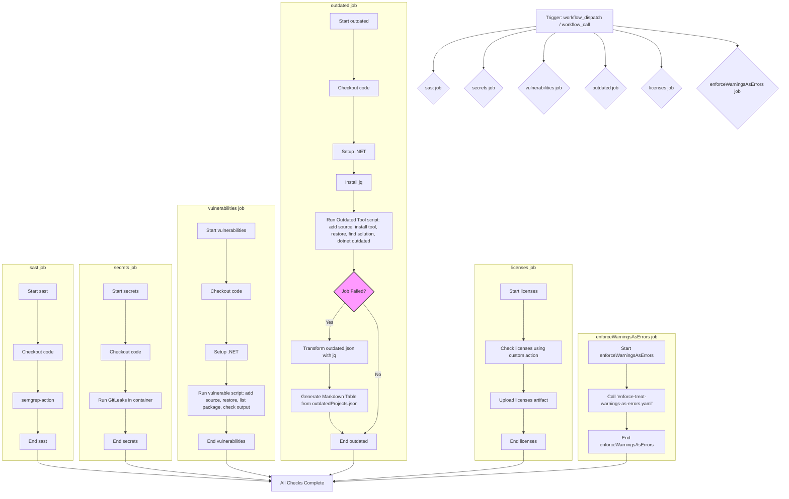
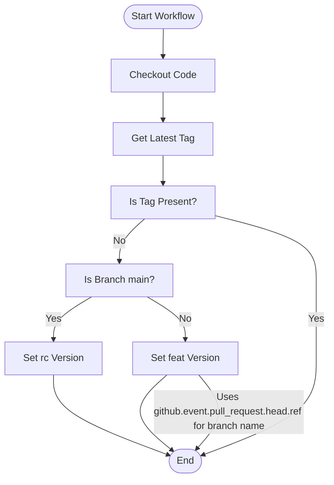
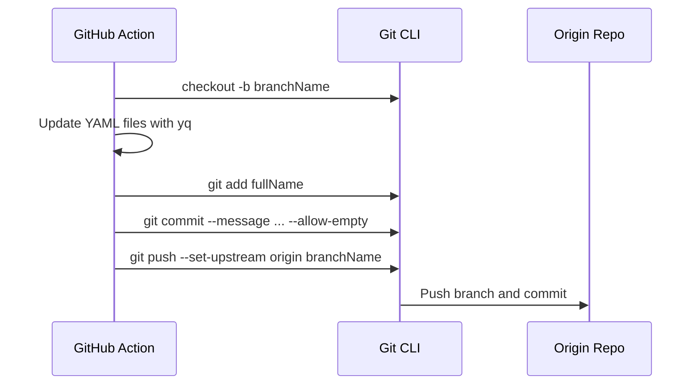
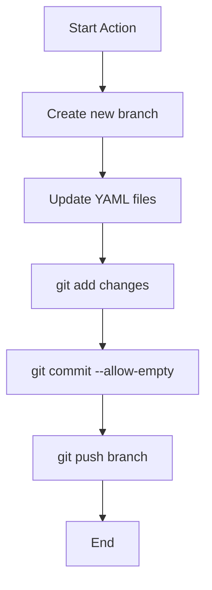

# Oui-DELIVER
CI/CD workflows and actions

### Merge Checks

```mermaid
flowchart TD
    A[Trigger: workflow_dispatch / workflow_call] --> B{sast job}
    A --> C{secrets job}
    A --> D{vulnerabilities job}
    A --> E{outdated job}
    A --> F{licenses job}
    A --> G{enforceWarningsAsErrors job}

    subgraph "sast job"
        B_Start[Start sast] --> B_Checkout[Checkout code]
        B_Checkout --> B_Semgrep[semgrep-action]
        B_Semgrep --> B_End[End sast]
    end

    subgraph "secrets job"
        C_Start[Start secrets] --> C_Checkout[Checkout code]
        C_Checkout --> C_GitLeaks[Run GitLeaks in container]
        C_GitLeaks --> C_End[End secrets]
    end

    subgraph "vulnerabilities job"
        D_Start[Start vulnerabilities] --> D_Checkout[Checkout code]
        D_Checkout --> D_SetupNet[Setup .NET]
        D_SetupNet --> D_RunVulnerable[Run vulnerable script: add source, restore, list package, check output]
        D_RunVulnerable --> D_End[End vulnerabilities]
    end

    subgraph "outdated job"
        E_Start[Start outdated] --> E_Checkout[Checkout code]
        E_Checkout --> E_SetupNet[Setup .NET]
        E_SetupNet --> E_InstallJq[Install jq]
        E_InstallJq --> E_RunOutdatedTool[Run Outdated Tool script: add source, install tool, restore, find solution, dotnet outdated]
        E_RunOutdatedTool --> E_CondFailure{Job Failed?}
        E_CondFailure -- Yes --> E_Transform[Transform outdated.json with jq]
        E_Transform --> E_Table[Generate Markdown Table from outdatedProjects.json]
        E_Table --> E_End[End outdated]
        E_CondFailure -- No --> E_End
    end

    subgraph "licenses job"
        F_Start[Start licenses] --> F_CheckLicenses[Check licenses using custom action]
        F_CheckLicenses --> F_UploadArtifact[Upload licenses artifact]
        F_UploadArtifact --> F_End[End licenses]
    end

    subgraph "enforceWarningsAsErrors job"
        G_Start[Start enforceWarningsAsErrors] --> G_CallReusableWorkflow[Call 'enforce-treat-warnings-as-errors.yaml']
        G_CallReusableWorkflow --> G_End[End enforceWarningsAsErrors]
    end

    B_End --> Z[All Checks Complete]
    C_End --> Z
    D_End --> Z
    E_End --> Z
    F_End --> Z
    G_End --> Z

    classDef condition fill:#f9f,stroke:#333,stroke-width:2px;
    class E_CondFailure condition;
```

### Build-Publish

```mermaid
flowchart TD
    A[Trigger: workflow_dispatch / workflow_call] --> B{version job};

    subgraph "version job"
        direction LR
        B_Start[Start 'version' job] --> B_SemVer[Execute 'oui-deliver/semantic-versioning-action'];
        B_SemVer --> B_Output[Output: Version];
        B_Output --> B_End[End 'version' job];
    end

    B --> C{build job};

    subgraph "build job"
        C_Start[Start 'build' job] --> C_Checkout[Checkout code];
        C_Checkout --> C_BuildDotNet[Build .NET project];
        C_BuildDotNet --> C_PushNugetCond{inputs.push-nuget-packages == 'true'?};
        C_PushNugetCond -- Yes --> C_PushNuget[Push NuGet packages];
        C_PushNugetCond -- No --> C_GenSBOMCond;
        C_PushNuget --> C_GenSBOMCond{inputs.generate-sbom == 'true'?};
        C_GenSBOMCond -- Yes --> C_GenSBOM[Generate SBOM];
        C_GenSBOMCond -- No --> C_UploadSBOMCond;
        C_GenSBOM --> C_UploadSBOMCond{inputs.upload-sboms == 'true' AND inputs.generate-sbom == 'true'?};
        C_UploadSBOMCond -- Yes --> C_UploadSBOM[Upload SBOMs to GitHub Artifacts];
        C_UploadSBOMCond -- No --> C_PublishContainerCond;
        C_UploadSBOM --> C_PublishContainerCond{inputs.publish-container-image == 'true'?};
        C_PublishContainerCond -- Yes --> C_LoginRegistry[Login to Container Registry];
        C_LoginRegistry --> C_BuildImage[Build Docker image];
        C_BuildImage --> C_PushImage[Push Docker image];
        C_PushImage --> C_UpdateArgoCond;
        C_PublishContainerCond -- No --> C_UpdateArgoCond;
        C_UpdateArgoCond{inputs.update-argocd == 'true'?};
        C_UpdateArgoCond -- Yes --> C_UpdateArgo[Execute 'oui-deliver/update-argocd-action'];
        C_UpdateArgo --> C_EndBuild;
        C_UpdateArgoCond -- No --> C_EndBuild[End 'build' job];
    end

    C --> Z[Workflow Finished];

    classDef condition fill:#f9f,stroke:#333,stroke-width:2px;
    class C_PushNugetCond,C_GenSBOMCond,C_UploadSBOMCond,C_PublishContainerCond,C_UpdateArgoCond condition;
```

### Semantic Versioning

#### Flow diagram for updated branch name sourcing in semver workflow

```mermaid
flowchart TD
    Start([Start Workflow])
    Checkout[Checkout Code]
    GetTag[Get Latest Tag]
    IsTag[Is Tag Present?]
    MainBranch[Is Branch main?]
    SetRC[Set rc Version]
    SetFeat[Set feat Version]
    End([End])

    Start --> Checkout --> GetTag --> IsTag
    IsTag -- No --> MainBranch
    MainBranch -- Yes --> SetRC --> End
    MainBranch -- No --> SetFeat --> End
    IsTag -- Yes --> End
    SetFeat -->|Uses github.event.pull_request.head.ref for branch name| End
```

### Update ArgoCD

#### Sequence diagram for updated ArgoCD update action commit process

```mermaid
sequenceDiagram
    participant Action as GitHub Action
    participant Git as Git CLI
    participant Remote as Origin Repo
    Action->>Git: checkout -b branchName
    Action->>Action: Update YAML files with yq
    Action->>Git: git add fullName
    Action->>Git: git commit --message ... --allow-empty
    Action->>Git: git push --set-upstream origin branchName
    Git->>Remote: Push branch and commit
```

#### Flow diagram for updated ArgoCD update action logic

```mermaid
flowchart TD
    A[Start Action] --> B[Create new branch]
    B --> C[Update YAML files]
    C --> D[git add changes]
    D --> E[git commit --allow-empty]
    E --> F[git push branch]
    F --> G[End]
```

